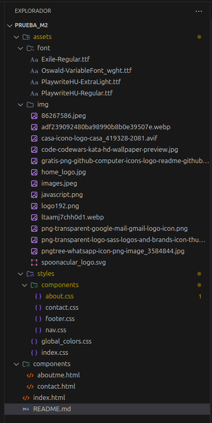

### Name: Denis Sanchez  (Van Rossum).
### Document: 3510756.
### Mail: contact.denis.sanchez@gmail.com.

# About project:
## This is a small exercise on a website from scratch using:

  Semantic code such as (header, nav, main, and footer).
  Color and font variables are used.
  Animations, transitions, and text and box overlays.
  Mouseover animations are used.
  For some sections, a display grid and flex display are used.

## Includes the following sections:
* About me.
* Contact.
* Personal portfolio.

## File structure:

## How to run:

### Using this deploy: 
    https://denisv2112.github.io/M2_HTML_Exam/

